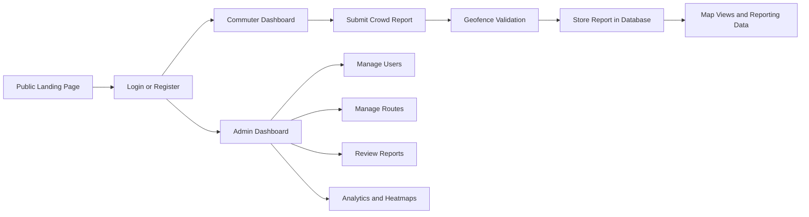

<div align="center">

# TransportOps

### Public Transport Operations Monitoring System

TransportOps is a PHP and MySQL web application for reporting, monitoring, and managing public transport activity. It combines commuter crowd reports, route mapping, trust scoring, and admin oversight in one system.

<p>
	
	
	
	
	
</p>

</div>

---

## Overview

TransportOps helps commuters submit real-time transport reports and gives administrators tools to manage routes, review system activity, and monitor operational data through dashboards and maps.

### What it does

- Collects crowd and delay reports from commuters
- Validates reports using route stop geofencing
- Tracks trust score and verification-related data
- Displays reports and routes through map-based views
- Lets admins manage users, routes, reports, analytics, and notifications
- Masks public user identities for privacy

## Quick Navigation

| Section | Purpose |
|---|---|
| [Features](#features) | Main commuter and admin capabilities |
| [System Flow](#system-flow) | High-level view of how the app works |
| [Tech Stack](#tech-stack) | Languages, libraries, and platform |
| [Local Setup](#local-setup) | How to run the project in XAMPP |
| [Usage Guide](#usage-guide) | How commuters and admins use the system |
| [Project Structure](#project-structure) | Important files and responsibilities |

## Features

| Commuter Side | Admin Side |
|---|---|
| Register and log in | Use dedicated admin login |
| Manage profile and profile image | View admin dashboard overview |
| Browse routes and route maps | Create and edit routes |
| Submit crowd and delay reports | Manage route stops |
| Provide live GPS or map-based location | Review and verify reports |
| View system maps and personal activity | Manage users and activity status |
| Benefit from privacy-protected public views | View analytics, heatmaps, and exports |

## System Flow



## Reporting Workflow

> A commuter can only submit a report after selecting a route and providing a location that is on or near the route.

1. Open the report submission page.
2. Choose a route.
3. Select a crowd level.
4. Optionally add a delay reason.
5. Set location using GPS or the map.
6. The system checks the nearest route stop.
7. If the user is within about 500 meters, the report is accepted.
8. The report is saved with trust and verification-related fields.

## Current Roles

| Role | Access |
|---|---|
| Admin | Dashboards, route management, report review, analytics, user management |
| Commuter | Registration, login, routes, maps, profile, report submission |

## Tech Stack

| Layer | Tools |
|---|---|
| Backend | PHP |
| Database | MySQL |
| Database Access | PDO |
| Frontend Styling | Tailwind CSS via CDN |
| Maps | Leaflet.js |
| Local Environment | XAMPP |

## Project Structure

| File | Purpose |
|---|---|
| index.php | Public landing page |
| login.php | Combined login, registration, and admin login |
| user_dashboard.php | Main commuter dashboard |
| admin_dashboard.php | Main admin dashboard |
| report.php | Report submission page |
| reports_map.php | Report map view |
| routes.php | Route browsing page |
| manage_routes.php | Admin route and stop management |
| profile.php | User profile management |
| db.php | Database connection configuration |
| database_master_combined.sql | Schema and seeded route data |
| privacy_helper.php | Public name masking helper |

## Local Setup

### 1. Place the project in XAMPP

```text
C:\xampp2\htdocs\system
```

### 2. Start required services

Start these services in XAMPP:

- Apache
- MySQL

### 3. Create and import the database

Expected database name:

```text
transport_ops
```

Schema file:

```text
database_master_combined.sql
```

Using phpMyAdmin:

1. Open http://localhost/phpmyadmin
2. Create or select the database named transport_ops
3. Import database_master_combined.sql

### 4. Check database config

Default values from db.php:

| Setting | Value |
|---|---|
| Host | localhost |
| Database | transport_ops |
| Username | root |
| Password | empty by default |

If your local MySQL setup differs, edit db.php.

### 5. Create the first admin account

Open this once in the browser:

```text
http://localhost/system/create_admin.php
```

Default admin credentials created by the script:

| Field | Value |
|---|---|
| Email | admin@gmail.com |
| Password | password |

> Change the default admin password if this environment will stay active.

### 6. Open the application

```text
http://localhost/system/
```

## Usage Guide

### Commuter Flow

1. Open the landing page.
2. Register an account or sign in.
3. Enter the commuter dashboard.
4. Browse available routes.
5. Submit a crowd report with location.
6. View route and report maps.
7. Manage profile details.

### Admin Flow

1. Open the login page.
2. Use the admin login panel.
3. Enter the admin dashboard.
4. Manage route definitions and route stops.
5. Review reports and related system data.
6. Monitor analytics, heatmaps, and user activity.
7. Use export and maintenance tools when needed.

## Utility And Maintenance Files

| File | Purpose |
|---|---|
| create_admin.php | Creates a default administrator account |
| verify_database.php | Checks parts of the database structure |
| verify_trust_database.php | Verifies trust-related database setup |
| add_last_login.php | Adds last-login related support |
| migration_add_rejections.php | Adds rejection-related schema support |
| sync_trust_scores.php | Synchronizes trust scores |

## Notes

> This project is currently tailored for local XAMPP development.

- Some frontend assets are loaded from CDNs, so local internet access may be needed for full styling and map behavior.
- Public-facing views use privacy helpers to censor names.
- The seeded SQL file already includes predefined transport routes and stop coordinates.

## Recommended Next Improvements

- Add screenshots or GIF previews to the README
- Move database credentials into an environment-aware config file
- Add a proper migration workflow for schema changes
- Document contributor roles and permissions
- Add deployment instructions for shared hosting or VPS setups

## License

No license file is currently included in this repository.